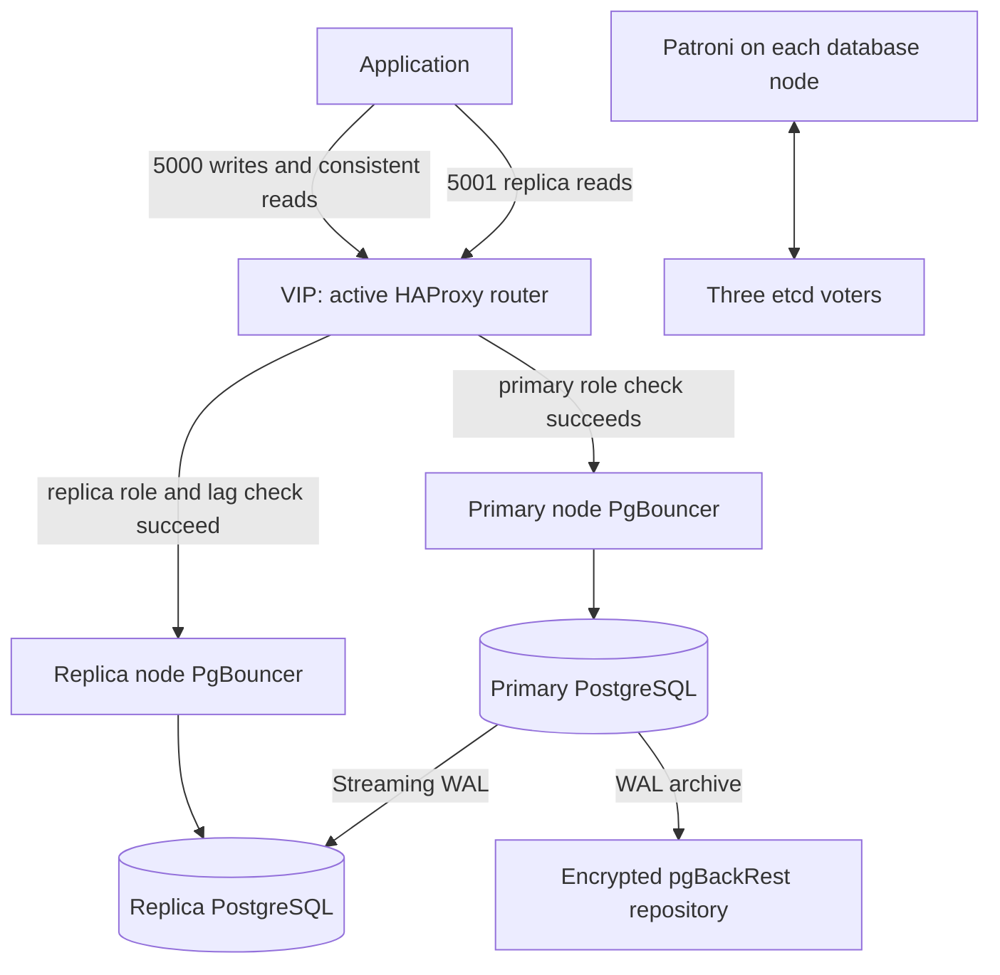

# PostgreSQL HA: administrator training and configuration guide

> Portable configuration: start with [the external deployment setup](environment-portability.md). Addresses in this guide are documentation-only ranges, names are examples, and `/home/OPERATOR` means your controller account. Read measured results as anonymized historical evidence; obtain real values from your own inventory and discovery.

For configuration-driven standalone/HA selection, explicit primary/replica/standby membership, version-aware extension packages and detailed variable/change guidance, read [deployment models and extensions](deployment-models.md). The procedures below document the existing Type A environment and its operational contract; they do not imply that HA components or backup integration are installed in standalone mode.

**Updated execution contract:** routine `site.yml` runs now inspect and plan. Read [Safe discovery, reconciliation and re-execution](safe-reexecution.md) before using provisioning or maintenance commands below. That guide defines the new explicit gates, platform opt-ins and supported existing-instance reconciliation parameters; it supersedes older entry-point examples here.

**Audience:** database administrators, Linux operators, application engineers and maintainers.  
**Implementation:** this repository, Ubuntu 22.04 amd64, PostgreSQL 14+ selection, Type A architecture.  
**Reference environment:** pg1/pg2/pg3; address configuration updated 13 September 2026. See [IP migration record](ip-migration.md).

This guide explains the implementation that exists, how to inspect and operate it, and how to plan environment-specific changes. Values shown for the deployed VMs are examples, not recommended sizing for every workload. Commands labeled **controller** run in Linux/WSL from the repository root. Commands labeled **node** run over SSH on a VM. Changes described as **migration procedures** require a tested implementation for that change; they are not capabilities provided by rerunning deployment.

No live infrastructure changes are made by this document. Preserve credentials, cluster identity, data and backups when following it. Do not copy private configuration into a ticket, terminal recording or public repository.

## Contents

1. [Architecture and failure behavior](#1-architecture-and-failure-behavior)
2. [Configuration ownership and change classes](#2-configuration-ownership-and-change-classes)
3. [Controller setup and access](#3-controller-setup-and-access)
4. [Connect applications](#4-connect-applications)
5. [Daily operating procedure](#5-daily-operating-procedure)
6. [Complete environment variable reference](#6-complete-environment-variable-reference)
7. [Fixed implementation settings and extension points](#7-fixed-implementation-settings-and-extension-points)
8. [Deploy a separate fresh environment](#8-deploy-a-separate-fresh-environment)
9. [Plan and execute configuration changes](#9-plan-and-execute-configuration-changes)
10. [Backup, restore and disaster recovery](#10-backup-restore-and-disaster-recovery)
11. [Troubleshooting by symptom](#11-troubleshooting-by-symptom)
12. [Scaling, replacement and upgrades](#12-scaling-replacement-and-upgrades)
13. [Playbook and tool reference](#13-playbook-and-tool-reference)
14. [Production handover and learning exercises](#14-production-handover-and-learning-exercises)
15. [References](#15-references)

## 1. Architecture and failure behavior

### 1.1 Components and responsibilities

| Component | Responsibility | What it does not establish by itself |
| --- | --- | --- |
| PostgreSQL | Stores data, executes SQL and streams WAL to replicas | Which server may safely become authoritative after a failure |
| Patroni | Starts/manages PostgreSQL, coordinates leadership through etcd, exposes authenticated role checks | A second copy of application data; PostgreSQL replication supplies that |
| etcd | Three-voter consensus store for Patroni coordination and dynamic policy | PostgreSQL backup or WAL retention |
| PgBouncer | Node-local connection pools; client TLS/SCRAM and verified TLS to local PostgreSQL | Primary selection or automatic read/write splitting |
| HAProxy | Selects primary or replica poolers through Patroni role checks and pool availability | SQL parsing, transaction migration or application retry |
| Keepalived | Moves a shared IPv4 VIP among usable routers using unicast VRRP | PostgreSQL promotion |
| Watchdog | Fences a node if Patroni stops servicing its armed watchdog | Proof that separate VMs have independent hypervisors, storage or power |
| pgBackRest | Encrypted base backups and archived WAL for restore/PITR | Off-site durability unless the repository is placed/replicated appropriately |
| Functional monitor | Periodic local, control-plane, SQL endpoint and recovery checks | External alert delivery or full performance monitoring |

The three core nodes each run the database, pooler, router, Patroni and an etcd voter. Additional database replicas are an architectural option. The complete platform/monitor/acceptance workflows still contain assumptions about the three-node profile; adding nodes requires qualification beyond passing inventory validation.

### 1.2 Connection paths



The diagram groups components logically; there are three HAProxy instances, one on each core VM. Only the VIP owner receives traffic sent to the VIP. That router can forward writes to another VM. A VIP on pg1 and a leader on pg2 are normal.

HAProxy checks Patroni over mutual TLS and checks the pooler's TCP listener. SQL TLS passes through HAProxy and terminates at PgBouncer. PgBouncer opens a separate, hostname-verified TLS connection to PostgreSQL. HAProxy chooses a backend per connection; it does not send SELECT statements to replicas automatically.

The read endpoint has no primary fallback. With no eligible replicas, reads through port 5001 fail. It is intentionally possible for port 5000 and port 5001 to have different availability.

### 1.3 Interpreting the current cluster

The user's latest listing showed pg2 as `Leader/running`, pg3 as `Sync Standby/streaming`, pg1 as `Replica/streaming`, all on timeline 5, with zero reported receive/replay lag. Roles are observations, not permanent inventory assignments. `cluster.bootstrap_host: pg2` only selects the initial creator.

The system identifier `SYSTEM_IDENTIFIER_FROM_DISCOVERY` identifies this PostgreSQL lineage. A replica in this cluster must have the same identifier. Timeline numbers advance after promotions; a changed timeline after a legitimate failover is not automatically corruption. Unexpected divergent histories require investigation.

### 1.4 Durability, availability and reads

Strict synchronous replication with one synchronous standby waits for an eligible standby's durable WAL acknowledgement for ordinary synchronous commits. Losing all eligible synchronous standbys can leave a running primary that blocks commits. Do not disable strict mode merely to make a health indicator green.

An acknowledged commit is not a promise that every replica has replayed it. The read endpoint can select the asynchronous replica, and replay may trail durable WAL receipt. Use port 5000 when an application needs immediate read-after-write behavior, or implement an explicit consistency protocol. Zero lag is a sampled observation.

Three etcd voters require a majority of two. One voter may be unavailable while consensus remains possible. Losing two voters can prevent safe leadership renewal/election. Adding database replicas does not increase etcd quorum tolerance.

Failover interrupts connections. A dropped COMMIT response can mean either the transaction committed or it did not. Reconnect and reconcile using a durable application idempotency key before retrying a write. Bound retries with backoff and a total deadline.

## 2. Configuration ownership and change classes

### 2.1 Where settings live

| Location | Purpose | Editing rule |
| --- | --- | --- |
| `inventories/<environment>/hosts.yml` | Groups, SSH destinations, node identities | Environment source of truth; keep complete topology |
| `group_vars/all.yml` under that inventory | Cluster policy, packages, sizing, backup/platform values | Review all related values together |
| `host_vars/<node>/platform.yml` | Per-node service address/interface/priority and firewall digest | This can override a `node` mapping in hosts.yml |
| `host_vars/<node>/tls.yml` | Controller paths to CA/certificate/key material | Paths only; private files remain outside the repository |
| Private `secrets.vault.yml` | Encrypted application and service credentials | Edit with Ansible Vault in a protected session |
| `roles/*/templates`, tasks and Python modules | Rendering, fixed settings, validation and service behavior | Code changes require review and appropriate tests |
| `/etc/pg-ha/...` on VMs | Rendered service configuration | Do not use as the only lasting source of truth |
| Patroni's etcd dynamic configuration | Current cluster-wide policy | Change through Patroni, not by modifying etcd keys directly |
| `/var/lib/pg-ha/identity.json`, `files.json` | Recorded ownership/policy and managed-file baseline | Preserve; authorize a specific migration before updating |
| Ignored `artifacts/` | Nonsecret discovery and acceptance evidence | Preserve incident/change history outside transient workspaces |

Ansible mappings are not universally deep-merged by default. A partial `--extra-vars '{"cluster": ...}'` can replace the full cluster mapping. Keep a complete environment mapping; use extra-vars for dedicated operation controls and the Vault file. Inspect the resolved nonsecret configuration with care: `ansible-inventory --list` can disclose secrets if it loads them.

### 2.2 Five change classes

| Class | Meaning | Examples |
| --- | --- | --- |
| Initial identity | Established when the cluster or storage is created | Cluster name, etcd initial token, initdb locale, data paths |
| Dynamic policy | Stored in Patroni DCS after initialization | TTL, synchronous policy, many PostgreSQL parameters |
| Local service configuration | Per-node rendered files | TLS paths, local shared buffers, HAProxy ACLs, pool settings |
| Platform/migration | Affects connectivity, storage or membership | VIP/subnet, volume growth, replacement node, etcd membership |
| Descriptive evidence | Documents an objective or verified result | RTO target, destination description, evidence references |

Editing `bootstrap.dcs` in YAML after initialization does **not** apply a new dynamic policy. Changing a value in inventory also does not change the deployed system until a suitable operation applies it. Conversely, a manual live edit without updating the reviewed source leaves drift.

The supported reconcilers are deliberately bounded: `reconcile.yml` applies approved reloadable parameters, and model `configure` adds approved missing extensions. There is no arbitrary OS/service/topology or baseline migration reconciler. `verify.yml` detects drift without repairing it. Completed clusters must not replay bootstrap. See [safe re-execution](safe-reexecution.md) and [change procedures](#9-plan-and-execute-configuration-changes).

## 3. Controller setup and access

### 3.1 Runtime and dependencies

Use a native Linux controller or WSL Linux session. The runner uses POSIX `fcntl` locking and a terminal for hidden SSH/sudo prompts. Running it directly with Windows Python is unsupported. The deployed controller used Ansible core 2.16.3; collection pins are in `requirements.yml`.

Controller prerequisites include Python, Ansible, OpenSSH client, `sshpass` for Ansible's password transport, PyYAML, cryptography, and PostgreSQL client libraries/psycopg2 for the optional acceptance workload. Use an organization-approved signed package source or a pinned Python environment. The historical controller has unqualified inherited apt sources; do not copy those into a new controller.

**Controller — install the repository's exact collection versions into the runner's search path:**

```bash
ansible-galaxy collection install -r requirements.yml \
  -p "$HOME/.local/share/pg-ha/collections"
```

`tools/link_controller_collections.py` is an alternative for existing verified collection copies in its supported local layout; it checks their manifests. It is not a general dependency downloader. Test the controller before connecting production hosts.

### 3.2 SSH identities and secret storage

1. Obtain each host's SSH public-key fingerprint from a trusted console or provisioning record.
2. Compare any network-observed key to that trusted identity. `ssh-keyscan` alone does not authenticate a server.
3. Maintain the verified entries in `artifacts/discovery/known_hosts.verified`, including nonstandard port syntax if applicable.
4. Use complete inventory and sudo-capable operator access. Keep a separate console recovery path.
5. Keep service secrets and CA keys in a native Linux directory owned by the controller account, mode 0700; private files use 0600.

The existing private directory is `/home/OPERATOR/.local/share/pg-ha/production`. It contains the encrypted Vault file, a restricted Vault-password file and PKI. A Vault file and its decryption key on the same controller are protected primarily by controller access controls. Back them up with appropriate encryption and access separation. The SSH password is prompted and is not stored by the credential generator.

### 3.3 A reusable command wrapper

**Controller — define this function in the current Bash session:**

```bash
PGHA_INVENTORY=inventories/local/hosts.yml
PGHA_PRIVATE="$HOME/.local/share/pg-ha/local"
pgha() {
  python3 tools/run_playbook.py "$@" \
    --inventory "$PGHA_INVENTORY" \
    --extra-vars "@$PGHA_PRIVATE/secrets.vault.yml" \
    --vault-password-file "$PGHA_PRIVATE/vault-password"
}
```

These variables hold paths, not passwords. Substitute the paths for another environment. Do not include the SSH password in the function. Run one project operation at a time; the runner takes a native Linux advisory lock. Manual commands and another controller do not honor that lock automatically, so coordinate them separately.

```bash
pgha playbooks/verify.yml
```

Enter SSH and become credentials only at the hidden prompts. Diagnose failures without bypassing gates or editing fingerprints. The runner has no general `--limit` or `--diff` interface. Its `--check` option predicts supported reconciliation changes; it is not proof that fresh provisioning will succeed.

## 4. Connect applications

### 4.1 Connection settings

| Setting | Existing environment | How to select it elsewhere |
| --- | --- | --- |
| TLS hostname | `postgres.db.example.com` | Stable application DNS name included in every pooler certificate SAN |
| Address | `192.0.2.50` | Reserved, unused VIP on the supported common router subnet |
| Write endpoint | `5000` | `cluster.ports.write`; use for writes and reads requiring primary consistency |
| Replica endpoint | `5001` | `cluster.ports.read`; use only for replica-compatible reads |
| Database | `appdb` | Entry in `application_databases` |
| Login | `app_owner` | Authorized role in Vault; use narrower runtime grants where appropriate |
| TLS mode | `verify-full` | Preserve hostname and issuer verification |
| Root certificate | Database CA public certificate | Distribute through trusted configuration management |

The managed hosts files resolve names on cluster VMs. They do not configure enterprise DNS or client machines. Publish an authoritative record, or use libpq `host` plus `hostaddr` while retaining the certificate hostname.

**Application/client host — an interactive psql example:**

```bash
psql "host=postgres.db.example.com hostaddr=192.0.2.50 port=5000 dbname=appdb user=app_owner sslmode=verify-full sslrootcert=/approved/path/database-ca.pem connect_timeout=5" -W
```

Replace `/approved/path/database-ca.pem` with the installed public CA file. `-W` prompts privately. Do not place passwords in a connection URI, shell history or source code. Applications should obtain them from a protected runtime secret mechanism. A 0600 passfile is an alternative where operationally approved.

**Inside psql:**

```sql
SELECT current_database(), current_user, pg_is_in_recovery();
SELECT ssl, version, cipher FROM pg_stat_ssl WHERE pid = pg_backend_pid();
```

On port 5000, recovery should be false. A fresh connection to port 5001 should show true. The SQL TLS query observes the pooler-to-PostgreSQL connection; it does not independently prove the client-side TLS hop. Client `verify-full` establishes the latter.

### 4.2 Pool compatibility and application behavior

Session pooling retains a server connection for the client session. It is the deployed compatibility choice. Keep application pools bounded and close idle sessions; hundreds of idle client sessions can occupy server slots in session mode.

Transaction pooling reuses server connections between transactions. Review session SET state, temporary objects, advisory locks, LISTEN/NOTIFY, prepared statement behavior and driver features against the exact PgBouncer release before adopting it. Do not assume changing `pool.mode` alone makes an application compatible. See the [PgBouncer reference](https://www.pgbouncer.org/config.html).

Set application/query time limits deliberately. PgBouncer may reject unsupported startup parameters: this project's monitor sets `statement_timeout` with SQL after connecting, rather than passing libpq `options` through the pooler. Apply transaction-local settings with `SET LOCAL` when the pooling mode requires it.

## 5. Daily operating procedure

### 5.1 Establish cluster state

**Node — any healthy core VM:**

```bash
sudo -u postgres patronictl -c /etc/pg-ha/patroni/patroni.yml list
sudo systemctl --no-pager --full status pg-ha-patroni pg-ha-etcd
sudo -u postgres cat /var/lib/pg-ha-monitor/status.json
```

Expect exactly one leader, streaming replicas, an appropriate synchronous standby and no unexplained timeline/lag differences. Inspect `checked_at` as well as `healthy`; an old successful status does not prove the timer still runs.

`/etc/patroni/config.yml.in` is a package template containing unresolved placeholders. It is not the deployed configuration. Use the `/etc/pg-ha/...` path as `postgres`; do not loosen its permissions to work around a read error.

### 5.2 Inspect the service layer

```bash
sudo systemctl --no-pager --full status \
  pg-ha-pgbouncer pg-ha-haproxy pg-ha-keepalived pg-ha-backup pg-ha-watchdog
sudo systemctl list-timers --all 'pg-ha-*'
sudo journalctl -u pg-ha-patroni --since '30 minutes ago' --no-pager
sudo journalctl -u pg-ha-monitor --since '30 minutes ago' --no-pager
ip -4 address show dev eth0
df -h /srv/postgres /srv/etcd /srv/pgbackrest
df -i /srv/postgres /srv/etcd /srv/pgbackrest
timedatectl show --property=NTPSynchronized --value
```

Use the actual interface and mounts in another environment. Check all routers to establish VIP uniqueness; a single node cannot see every possible partition. Inspect logs in a restricted session and redact credentials or application data before sharing.

The vendor `postgresql`, `patroni`, `pgbouncer`, `haproxy` and `keepalived` units are masked where applicable. Manage the `pg-ha-*` units. PostgreSQL lifecycle belongs to Patroni; do not start a vendor PostgreSQL instance independently.

### 5.3 Inspect PostgreSQL safely

**Node — open local privileged psql:**

```bash
sudo -u postgres psql -h /run/pg-ha-patroni -p 5432 -d postgres
```

**SQL — role, WAL replication, slots and archive state:**

```sql
SELECT pg_is_in_recovery();
SELECT application_name, client_addr, state, sync_state,
       sent_lsn, write_lsn, flush_lsn, replay_lsn
FROM pg_stat_replication;
SELECT status, received_tli, written_lsn, flushed_lsn, latest_end_lsn
FROM pg_stat_wal_receiver;
SELECT slot_name, slot_type, active, restart_lsn, wal_status, safe_wal_size
FROM pg_replication_slots;
SELECT archived_count, failed_count, last_archived_time, last_failed_time
FROM pg_stat_archiver;
```

The primary normally has sender rows; replicas have a receiver row. Archive failure counters are cumulative: correlate failure time with later successful archiving. Slot limits can invalidate a lagging replica's retained WAL path; alert before that point. Never remove files from `pg_wal` to recover free space. Column semantics are documented in the [PostgreSQL 17 statistics reference](https://www.postgresql.org/docs/17/monitoring-stats.html).

### 5.4 Finish with whole-cluster verification

**Controller:**

```bash
pgha playbooks/verify.yml
```

This verifies recorded configuration/policy, versions, certificate identities, actual SQL roles, replication, etcd and VIP behavior. It is a no-change check of the core deployment, not a repair operation. Record the result and investigate any divergence before maintenance.

## 6. Complete environment variable reference

Read the exact constraints in `module_utils/cluster_contract.py`, `module_utils/network_policy.py`, preflight and platform tasks before changing the profile. Passing type/range checks is necessary but does not establish appropriate sizing. The reference below covers declared environment inputs; section 7 lists consequential settings still fixed in implementation.

### 6.1 Topology, identity and access

| Key | Meaning / existing example | Selection and change impact |
| --- | --- | --- |
| `postgres_cluster` inventory group | All database members | At least three. Include initial extra replicas only after qualifying platform and monitoring assumptions; live additions need a membership procedure |
| `etcd_cluster` group | Exactly three initial voters | Must be PostgreSQL members; distribute over independently verified failure domains |
| `routers` group | Same three hosts as etcd | Additional routers are a different profile requiring validation changes |
| `ansible_host` | SSH and service IP; pg1 `192.0.2.21`, pg2 `192.0.2.22`, pg3 `192.0.2.23` | Reachable from controller, not necessarily service IP. Update verified host-key mapping on legitimate host replacement |
| `ansible_user` | `dbadmin` | Sudo-capable operator account. Coordinate privileges and recovery access |
| `ansible_port` | SSH port, normally 22 | Match actual sshd and firewall; discovery separately receives `--port` |
| `node.address` | Stable service IP; for example `192.0.2.21` | Unique reserved IPv4, excluded from dynamic DHCP allocation and bound to the intended MAC. Used for listeners, peers, TLS, firewall and replication; changing is a network/identity migration |
| `node.dns_name` | E.g. `pg1.db.example.com` | Unique, resolvable from all peers and matching expected node identity/SAN. DNS changes require certificate and connectivity coordination |
| `node.interface` | `eth0` | Determine with `ip -br address` and routes. Required by this platform workflow on targets; wrong interface can break VIP/network access |
| `node.priority` | Unique router priority, 1–254 | Relative VRRP preference, not PostgreSQL priority. `nopreempt` means a recovered preferred router does not immediately reclaim VIP |
| `node.failure_domain` | E.g. `vm-pg1` | Use real rack/AZ/hypervisor placement evidence. Distinct strings alone do not prove independence |
| `node.firewall_sha256` | Normalized effective nftables digest | Obtained from project firewall inspection after reviewed policy application. Never invent or replace it merely to hide drift |
| `cluster.name` | `pg_ha` | Safe, unique identifier used for Patroni scope and backup stanza. Treat as initial identity; renaming is a migration |
| `cluster.bootstrap_host` | `pg2` | One core member selected to create the first PostgreSQL cluster. It does not pin future leadership |
| `cluster.etcd_token` | Unique initial cluster token | Prevent accidental initial cluster mixing; not a password. Preserve for the recorded initial plan; do not change to repair a live DCS |
| `cluster.vip` | `192.0.2.50` | Reserved unused address in common router subnet; ARP checks supplement IPAM, not replace it |
| `cluster.vip_prefix` | `24` | Actual subnet prefix, 1–32 with usable distinct host address; coordinate platform prefix |
| `cluster.vip_dns_name` | `postgres.db.example.com` | Stable client-facing name, pooler SAN and client configuration. DNS publication is external |
| `cluster.vrid` | `51`, allowed 1–255 | Avoid conflicts with other VRRP instances on the same network; change all peers coherently |
| `cluster.client_cidrs` | `192.0.2.0/24` | Smallest approved application source networks as observed after NAT; HAProxy source ACL |
| `cluster.admin_cidrs` | `192.0.2.0/24` | Approved administrator source networks; affects routing ACL and PostgreSQL HBA. Does not independently open every host firewall path |

CIDRs must be canonical IPv4 networks narrower than `/0`. The deployed broad lab subnet should be narrowed for segmented production networks after actual client/NAT paths are established.

### 6.2 Ports and coupled network settings

| Key | Default | Consumers that must agree |
| --- | --- | --- |
| `cluster.ports.postgres` | 5432 | PostgreSQL, poolers, replication, backup, local SQL checks |
| `cluster.ports.pgbouncer` | 6432 | Pooler listener, HAProxy backend, firewall |
| `cluster.ports.patroni` | 8008 | Patroni API, HAProxy health checks, monitor, peer firewall |
| `cluster.ports.etcd_client` | 2379 | Patroni DCS clients, etcd listener, checks/firewall |
| `cluster.ports.etcd_peer` | 2380 | etcd peer URLs/listener and peer firewall |
| `cluster.ports.write` | 5000 | HAProxy frontend, clients, monitor, firewall |
| `cluster.ports.read` | 5001 | Replica frontend, clients, monitor, firewall |
| `backup_port` | Deployed 8432 | pgBackRest TLS servers and clients |
| `platform_ports.backup` | 8432 | Platform backup firewall port; keep aligned with `backup_port` |

The seven cluster TCP ports must be distinct and unprivileged (1024–65535). Keep backup and SSH listeners nonconflicting too. `platform_ports` also contains component defaults; keep any platform override aligned with `cluster.ports` and inspect the rendered firewall. Do not override derived aliases such as `pg_port` or `write_port` independently.

VRRP is IP protocol 112, not TCP/UDP port 112. The implementation supports IPv4 on a common subnet with unicast VRRP. Cloud anti-spoofing, routed VIPs, IPv6 and managed load balancers require another qualified network design.

### 6.3 Storage and admission thresholds

| Key | Existing value | Selection and impact |
| --- | --- | --- |
| `cluster.postgres_mount` | `/srv/postgres` | Dedicated persistent database filesystem; account for data, indexes, WAL, temporary files and retained restore tests |
| `cluster.data_dir` | `/srv/postgres/data` | Dedicated subdirectory, not mount root or symlink; moving live data needs a storage migration |
| `cluster.etcd_mount` | `/srv/etcd` | Dedicated low-latency persistent filesystem |
| `cluster.etcd_data_dir` | `/srv/etcd/data` | Separate nonoverlapping etcd directory; never substitute an empty path during recovery |
| `cluster.allowed_filesystems` | `[ext4]` | Contract accepts ext4/xfs; supplied platform formatter creates ext4 only. Choosing xfs requires platform implementation work |
| `cluster.min_free_bytes` | 268435456 (256 MiB) | Admission floor, not a sufficient workload budget; set from outage/WAL growth and intervention time |
| `cluster.min_ram_mb` | 3500 | Minimum admitted host RAM, not allocated memory; leave room for all colocated services |
| `cluster.min_vcpus` | 2 | Minimum CPU admission; size from peak concurrency, latency and backup/replication overhead |
| `cluster.locale` | `C.UTF-8` | initdb locale: choose application collation requirements before creation. Changing later is a database migration/rebuild concern |
| `platform_volume_group` | `data-vg` | Existing VG with enough unused extents; discover with `vgs`/`lvs` |
| `platform_volumes[].name` | `pg_ha_postgres`, `pg_ha_etcd`, `pg_ha_backup` | Must match `pg_ha_[a-z0-9_]+`; existing LV must have project ownership tag |
| `platform_volumes[].size` | `6G`, `512M`, `1G` | Positive integer M/G size. Initial allocator refuses shrinking; it is not a complete live filesystem growth workflow |
| `platform_volumes[].mount` | `/srv/postgres`, `/srv/etcd`, `/srv/pgbackrest` | Supported `/srv/<safe-name>` path; synchronize with data/repository locations |

Size WAL reserve from measured peak WAL bytes/second multiplied by the maximum archive outage or replica interruption you plan to tolerate, plus operating headroom. Size backup storage from measured compressed full backup sizes, required generations, archived WAL retention and growth. A 6 GiB database volume and 1 GiB repository are demonstration-scale resources, not generic production capacities.

### 6.4 Platform network inputs

| Key | Purpose | Selection and impact |
| --- | --- | --- |
| `platform_service_prefix` | Actual existing service/VIP subnet prefix; 24 in the reference environment | Match the actual LAN, routing and VIP plan |
| `platform_vip` | Platform's VIP declaration | Keep equal to `cluster.vip`; duplicate declarations are a current implementation limitation |
| `platform_vip_dns` | Platform hosts-file name | Keep equal to `cluster.vip_dns_name` |
| `platform_ssh_cidrs` | Host firewall SSH source networks | Include actual controller/NAT source and approved recovery access before applying |
| `platform_client_cidrs` | Host firewall application endpoint networks | Coordinate with cluster client/admin ACLs; both firewall and HAProxy must allow a connection |
| `platform_change_confirmation` | Exact `PROVISION PLATFORM` operation control | Initial platform mutation authorization, not a permanent setting to enable arbitrary updates |

The network role retains DHCP while declaring a persistent service address and explicit peer source routes. In the migrated reference environment the service and management addresses are the same; VMware reservations exclude these addresses from dynamic allocation. Do not reuse this profile blindly for static-only hosts or another renderer. Network and firewall changes use timed rollback and connectivity checks; console recovery still matters.

### 6.5 Replication and fencing

| `cluster.replication` key | Existing value / units | How to select and what changes |
| --- | --- | --- |
| `mode` | `strict_sync` | Durability/availability policy; only `strict_sync` and `async` supported. Async permits data loss on promotion |
| `acknowledge_async_data_loss` | `false` | Must be true for async. It records explicit acceptance, not a mitigation |
| `synchronous_node_count` | 1 standby | Strict mode requires 1..N−1, async requires 0. More required acknowledgements increase failure-domain coverage but may block writes with fewer available standbys |
| `maximum_lag_on_failover` | 1048576 bytes | Candidate eligibility bound; use measured WAL rate and loss tolerance. A byte bound is not a precise time/RPO guarantee |
| `read_lag_bytes` | 1048576 bytes | HAProxy replica health threshold. Lower values reduce stale-read exposure but can remove replicas during bursts |
| `ttl` | 60 seconds, minimum 20 | Leadership lease timing. Larger values can increase failover time; too small can destabilize under pauses |
| `loop_wait` | 5 seconds | Patroni control loop interval; shorter increases coordination frequency/load |
| `retry_timeout` | 5 seconds | Retry timing for coordination/database operations; allow measured latency without violating watchdog constraints |
| `max_slot_wal_keep_size_mb` | 512 MiB | Bound on WAL retained by slots; too small can require replica recovery, too large threatens disk capacity |
| `max_wal_senders` | 8 | Sender capacity for replicas and base-backup/maintenance activity; budget beyond steady replica count |
| `max_replication_slots` | 8 | Slot capacity with maintenance headroom; does not itself create or safely remove slots |

Timer checks require `loop_wait + 2 × retry_timeout <= ttl` and the project's stricter watchdog condition `loop_wait + retry_timeout < ttl/2`. For odd TTLs, the validator uses integer division, so check its exact result. Do not tune one timer independently. See [Patroni dynamic configuration](https://patroni.readthedocs.io/en/latest/dynamic_configuration.html).

`cluster.watchdog_device` is `/dev/watchdog`. Required watchdog mode and a half-TTL safety margin are fixed. Select a device only after verifying driver behavior, ownership, boot readiness and real fencing. Software watchdog success does not qualify a paused hypervisor or shared-host outage.

### 6.6 PostgreSQL resource parameters

| `cluster.postgres` key | Existing value | Selection and impact |
| --- | --- | --- |
| `max_connections` | 100 | Per-server connection ceiling. Budget all database pools, direct clients and maintenance. More connections increase resource pressure; inspect parameter context and restart requirements |
| `superuser_reserved_connections` | 5 | Emergency superuser capacity. Preserve enough for diagnosis; it reduces ordinary connection capacity |
| `shared_buffers_mb` | 512 MiB | PostgreSQL shared buffer allocation; local Patroni YAML. Leave memory for OS cache, queries, backup and all colocated daemons; restart required |
| `max_wal_size_mb` | 512 MiB | Checkpoint/WAL sizing target; tune from write rate and checkpoint behavior. It is not a hard disk-usage cap |

Measure memory rather than multiplying a rule by total RAM. Query memory may be consumed by multiple operations and sessions concurrently. This host runs several services, so a dedicated-database sizing rule does not directly apply. `shared_buffers` is a startup parameter; consult the [PostgreSQL 17 resource reference](https://www.postgresql.org/docs/17/runtime-config-resource.html) and the server's `pg_settings` metadata.

```sql
SELECT name, setting, unit, context, pending_restart
FROM pg_settings
WHERE name IN ('max_connections', 'superuser_reserved_connections',
 'shared_buffers', 'max_wal_size', 'max_wal_senders',
 'max_replication_slots', 'max_slot_wal_keep_size');
```

Treat `postmaster` context as restart-required; determine reload behavior from the actual setting. PostgreSQL settings with standby capacity constraints need direction-aware ordering when increased or decreased; do not assume the same restart order works both ways.

### 6.7 Pool and timeout budgets

| Key | Existing value | Selection and impact |
| --- | --- | --- |
| `cluster.pool.mode` | `session` | Compatibility versus reuse; transaction mode requires application qualification |
| `cluster.pool.max_client_conn` | 200 | PgBouncer client ceiling and HAProxy global `maxconn`; include file descriptors and client retry bursts |
| `cluster.pool.default_pool_size` | 10 | Server pool size per user/database pool; many users multiply demand |
| `cluster.pool.reserve_pool_size` | 5 | Additional burst connections; include them in database capacity planning |
| `cluster.pool.max_db_connections` | 50 | Pooler server cap per database per node; multiple databases add up |
| `cluster.timeouts.connect_seconds` | 5 seconds | HAProxy connection/check timeout and pooler server connect timeout; too low rejects slow-but-valid paths |
| `cluster.timeouts.client_seconds` | 300 seconds | HAProxy client-side inactivity timeout; not SQL statement timeout |
| `cluster.timeouts.server_seconds` | 300 seconds | HAProxy server-side inactivity timeout; long silent queries/sessions may be disconnected |

For example, two databases each permitted 50 pooler server connections can consume 100 ordinary backend connections on a node, exceeding a 100-connection PostgreSQL budget with five superuser slots reserved. Include direct/monitoring activity and use actual workload concurrency. More HAProxy routers do not create more local PgBouncer instances on the same database node.

### 6.8 etcd and software provenance

| Key | Existing value / meaning | Selection and impact |
| --- | --- | --- |
| `cluster.etcd.heartbeat_ms` | 100 ms | Choose from measured peer RTT and scheduling latency across all voters |
| `cluster.etcd.election_ms` | 1000 ms | Must be at least five heartbeat intervals under this contract; too short causes elections, too long delays recovery |
| `cluster.etcd.quota_bytes` | 134217728 (128 MiB) | Database backend quota; size and alert from actual growth. Quota exhaustion can block coordination writes |
| `cluster.packages` | Exact apt version map | Must contain precisely the nine package names in the example; no wildcards. Includes PostgreSQL/common/client, Patroni, HAProxy, PgBouncer, Keepalived, psycopg2 and etcd3gw |
| `cluster.expected_versions` | Numeric Patroni/etcd/HAProxy/PgBouncer/Keepalived releases | Match actual binary output as well as apt pins. Minimum feature families are validated; etcd is restricted to 3.5.x |
| `cluster.etcd_artifact.url` | HTTPS release tarball | Correct OS/architecture and approved provenance; current installer is amd64-specific |
| `cluster.etcd_artifact.sha256` | Exact 64-character lowercase digest | Independently verify release artifact. A digest proves identity only when its source is trusted |
| `backup_package_version` | Exact pgBackRest apt version | Separate from `cluster.packages`; qualify server/repository compatibility and restore |

Package values are deployment pins, not instructions to install today's latest version. See the [deployment record](deployment-record.md) for recorded releases. Pin/snapshot transitive dependencies as part of release engineering. Changing Ubuntu or PostgreSQL major version requires code, path and migration qualification; the architecture model accepts quoted PostgreSQL majors 14 and above; changing the value is not an upgrade.

### 6.9 Backups, databases and credentials

| Key | Existing value / meaning | Selection and impact |
| --- | --- | --- |
| `backup_repository_host` | `pg3` | Managed inventory host storing repository; relocation requires copying/validating history and changing transport/archiving coherently |
| `backup_repository_path` | `/srv/pgbackrest/repository` | Dedicated repository path; include capacity, ownership and systemd writable paths |
| `backup_schedule` | Default `*-*-* 02:15:00 UTC` | systemd calendar expression; choose quiet period and validate calendar. Random delay is up to 300 seconds |
| `cluster.backup.archive_executable` | Generic archive helper path | Generic integration contract; with managed backup, native pgBackRest archive-push is selected instead |
| `cluster.backup.restore_executable` | `/usr/local/libexec/pg-ha/restore-wal` | WAL retrieval helper; receives filename then destination. Must return real retrieval failure |
| `cluster.backup.destination_description` | Human-readable repository description | Documentation only; does not provision an external destination |
| `cluster.backup.retention_description` | Two daily full backups | Documentation only; actual retention is fixed in pgBackRest template |
| `cluster.backup.rpo_seconds` | 60 seconds | Recovery objective and source for initial `archive_timeout`; zero maps to 60 in template. Neither value guarantees archive RPO under failures |
| `cluster.backup.rto_seconds` | 3600 seconds | Recovery time objective recorded in policy; not an enforced restore timeout |
| `application_databases[].name` | `appdb` | Initial SQL database and pooler mapping; adding live requires separate role/database/pool/HBA workflow |
| `application_databases[].owner` | `app_owner` | Existing authorized application role; ownership permits schema control, so design narrower runtime roles if needed |
| `vault_app_users[].name/password` | Application login and random secret | Initial SCRAM role and pooler verifier. Rotation must synchronize database, poolers, applications and monitor |
| `vault_pg_superuser_password` | Database service superuser secret | Protected privileged credential; rotate without losing Patroni access |
| `vault_pg_replication_password` | Replicator secret | Coordinate across primary and all reconnecting receivers |
| `vault_patroni_api_password` | API mutation credential for `operator` | Combined with management client TLS; never expose to application users |
| `vault_backup_cipher_pass` | Repository encryption passphrase | Required for old backup recovery; changing text is not re-encryption/rotation |
| `tls_sources.<service>.ca/cert/key` | Per-host controller paths | Correct CA domain, DNS/IP SAN, EKU and matching key; files are copied with restricted ownership |

Use at least 24-character random service/application secrets, as required by the project. The HA generator retains existing credentials and certificates; rerunning it does not rotate passwords, update SANs or renew existing leaves. It initially creates `app_owner`; a different application identity must be intentionally provisioned in Vault and database policy.

Four separate CA domains are database, management, DCS and backup. `tls_sources` service entries are `postgres`, `pgbouncer`, `patroni`, `haproxy`, `etcd`, `dcs`, `backup`; routers/voters need their corresponding services. Database clients receive only the database CA public certificate. DCS client keys have broad authority because per-key etcd RBAC is not configured.

### 6.10 Evidence and execution controls

Each `cluster.evidence` entry is a reference to real supporting material: `network_and_vrrp`, `firewall_policy`, `fencing_test`, `backup_restore_test`, `repository_provenance`, `monitoring_and_alerts`, `exclusive_change_lock`. Describe incomplete qualifications honestly. A nonempty string is not proof of success.

`deployment_mode` defaults to `audit`. `bootstrap` requires `bootstrap_confirmation: CREATE <cluster-name>`. `resume` requires `RESUME <cluster-name>`, the exact incomplete bootstrap plan, and no completed identity. `verify` invokes runtime checking. Use dedicated `verify.yml` for normal completed-cluster verification.

Restore/export/failure confirmations and selectors are documented in sections 10 and 13. They belong to the individual operation, not permanently enabled in environment defaults.

## 7. Fixed implementation settings and extension points

These consequential settings are **not currently exposed as supported environment variables**. An inventory key has no effect unless templates/tasks consume it. Make implementation changes in a reviewed revision and retain safe defaults.

| Source | Fixed behavior | When to extend / required verification |
| --- | --- | --- |
| `roles/backup/templates/pgbackrest.conf.j2` | Full retention 2, process count 2, zst compression, archive wait 120 seconds, AES-256-CBC | Larger histories or backup throughput need capacity/restore tests. Cipher changes require repository migration |
| `playbooks/backup-schedule.yml` | Full backups only, random delay 300 seconds, job timeout 3600 seconds | Qualify duration and alerting before adopting for larger databases |
| `roles/monitoring/tasks/main.yml` | 60-second interval, 5-second jitter, boot delay 90 seconds, service timeout 90 seconds | Align detection objectives and execution duration |
| `roles/monitoring/files/health_monitor.py` | Free space below 15%, certificate horizon 30 days, backup age 26 hours, archive failure age 120 seconds | Match growth, renewal lead time and schedule. Current expiry loop covers postgres/patroni/dcs leaves; add other leaves and CA expiry to external monitoring |
| `roles/routing/templates/haproxy.cfg.j2` | Check interval 2 seconds, fall/rise 2, shutdown sessions on marked-down backend, leastconn | Detection versus flapping; verify real SQL session behavior |
| `roles/routing/templates/keepalived.conf.j2` | Unicast, advert 1 second, BACKUP initial state, nopreempt, routing check interval/timeout 2 seconds | Network-specific VRRP qualification |
| `roles/patroni/templates/patroni.yml.j2` | `/service/` namespace; required watchdog with margin −1; rewind/removal disabled; TLS/integrity settings | Authority and data-retention changes need failure/recovery qualification |
| `roles/platform/tasks/watchdog-startup.yml` | softdog startup and clock readiness | Hardware watchdog or another time service needs platform work |
| `playbooks/platform-repositories.yml` | Ubuntu jammy amd64 PGDG URL, signing fingerprint and utility packages | Other OS/architecture/mirror is a code/provenance change |
| Templates/tasks across roles | `/etc/pg-ha`, `/var/lib/pg-ha`, sockets and service paths | `config_root`, `state_root`, `binary_dir` are not universal relocation switches; many paths remain literal |
| Restore/export playbooks | `/srv/postgres/restore-acceptance-*`, isolated socket/55432, bounded export | Other storage layouts and large exports need qualified procedures |
| `tools/acceptance_client.py` | Current deployment connection/workload assumptions | Inspect and adapt before another environment; not a generic benchmark |

A parameter extension needs a documented variable with units/default, validation including cross-field constraints, consistent consumption, a meaningful behavior test, and a deployment/migration procedure. Find all consumers before changing a path or port:

```bash
rg -n 'repo1-retention-full|93600|OnUnitActiveSec|/srv/postgres' roles playbooks tools
```

Do not promise portability until rendered configurations, native parsers and representative deployment pass.

## 8. Deploy a separate fresh environment

Follow the current [installation and usage guide](installation.md) for controller
setup, separate standalone/HA inventories, exact model variables, prerequisites,
maintenance gates and first-run verification. It replaces the earlier combined
bootstrap recipe. Existing pg1/pg2/pg3 must not be bootstrapped again.

Use [environment settings](environment-settings.md) to distinguish actual defaults
from the reference values in section 6. Use [feature controls](features.md) to
decide whether the automation should manage each platform subsystem. Every
platform flag defaults false; running a legacy deployment helper does not silently
grant management of storage or networking.

After first deployment, qualify client SQL, backups/isolated restores, monitoring
and relevant failures before business traffic. Follow section 10 for recovery
procedures; those tests can write data or interrupt service and require their
individual operation approvals. Partial initialization is retained for diagnosis.

## 9. Plan and execute configuration changes

### 9.1 Standard maintenance sequence

1. Define desired behavior, exact settings, affected dependencies, interruption and rollback boundary.
2. Verify backups, quorum, replicas, capacity and fencing. Postpone if another member is unhealthy.
3. Capture protected current config, inventory policy, versions and relevant runtime values. Avoid unrestricted configuration dumps in records.
4. Classify the change and prepare a scoped maintenance playbook. No universal live-update command exists here.
5. Render candidates, validate natively where supported, inspect nonsecret differences and test in staging.
6. Serialize changes and verify after each node. Ordinary service changes can begin on a replica/non-VIP node; PostgreSQL standby-constrained settings may require direction-aware ordering.
7. Verify actual settings, SQL endpoints, replication, watchdog, etcd, archiving and application outcomes.
8. Migrate only the reviewed baseline differences after acceptance, retaining old evidence. Do not broadly regenerate fingerprints to hide unrelated drift.
9. Run independent verification. Configuration rollback requires compatible binaries, secrets and policy; database rollback is a separate recovery decision.

### 9.2 Example: increase shared buffers

Suppose measurements justify 768 MiB instead of 512 MiB. This is an illustrative candidate, not advice for these small VMs.

1. Confirm peak memory headroom including backup/query concurrency and all colocated daemons.
2. Update `cluster.postgres.shared_buffers_mb` in the complete reviewed inventory; retain meaningful admission thresholds.
3. Stage protected local Patroni YAML on a replica. Validate with the installed Patroni validator; its documented `--ignore-listen-port` mode is relevant for occupied live listeners. Do not bootstrap to render a live change.
4. Reload Patroni's local configuration through a controlled procedure, inspect pending/effective values, then restart that replica's PostgreSQL through Patroni.
5. Wait for streaming/catch-up, healthy watchdog and SQL/routing acceptance before continuing.
6. Update the next replica, perform a planned switchover and handle the former primary last while preserving synchronous capacity.
7. Check `SHOW shared_buffers` on all nodes and migrate only intended inventory/file baseline differences.

If the candidate fails, restore prior compatible local config on that node and restart through the same process while surviving authority remains healthy. Never restart all nodes together.

### 9.3 Dynamic policy

**Node — restricted administrative session, inspection:**

```bash
sudo -u postgres patronictl -c /etc/pg-ha/patroni/patroni.yml show-config pg_ha
```

For a reviewed live change, the interactive **mutation** is:

```bash
sudo -u postgres patronictl -c /etc/pg-ha/patroni/patroni.yml edit-config pg_ha
```

Review the full proposed diff and confirmation. Have one policy writer; avoid replacing a stale entire configuration. Update matching declared source and migrate its baseline afterward. Reloadable versus restart-required PostgreSQL settings remain distinct even when stored in DCS.

`maximum_lag_on_failover` changes candidate eligibility through DCS; `read_lag_bytes` changes a generated HAProxy check URL and needs router configuration application. Similar names do not imply the same configuration layer.

### 9.4 Planned switchover

1. Observe the current leader rather than assuming pg2 remains leader.
2. Verify voters, caught-up candidate, synchronous capacity, backups and watchdog. Coordinate client interruption.
3. Run interactive Patroni switchover:

```bash
sudo -u postgres patronictl -c /etc/pg-ha/patroni/patroni.yml switchover pg_ha
```

4. Select the actual leader and healthy candidate at prompts; review confirmation, without forcing an ineligible member.
5. Confirm exactly one new leader, old-primary demotion/rejoin, sync selection and endpoint roles. VIP movement is not required.
6. Reconcile transaction outcomes and run independent verification.

Use Patroni's restart operation with an explicitly chosen member for planned restarts. Assess which standby is synchronous first; a replica restart can still block commits. Do not issue a blanket all-member restart.

Review interactive command options against the installed version's help and the [patronictl reference](https://patroni.readthedocs.io/en/latest/patronictl.html) before a maintenance window.

### 9.5 VIP, DNS, ports and access

Plan reservations, DNS/SAN overlap, firewall/ACL, listeners, role checks, DCS/replication/backup consumers, monitors, client rollout and rollback together. Stage non-VIP routers first where feasible; verify uniqueness throughout cutover.

For node IP changes, etcd peer certificates must authorize the new source IP, and the HTTP gateway used by Patroni must be tested independently from native gRPC health. Stage overlapping certificate identities before moving peers, then restart and validate each gateway before retiring old addresses. See the [migration incident and recovery record](ip-migration.md).

Changing only `cluster.vip` leaves `platform_vip`, certificates, clients, DNS, monitor and baseline potentially inconsistent. Database/DCS ports are more invasive than frontend ports. Do not run broad platform provisioning just to update one firewall rule.

### 9.6 Password and certificate rotation

Prepare credentials privately and inventory every consumer. Maintain compatible overlap where possible; coordinate SQL credentials, exact PgBouncer verifier, clients and monitor; test reconnects; retire old access after acceptance. A second restricted application login can offer overlap if the grant model permits it. Bootstrap is not a rotation playbook.

The bootstrap copies PostgreSQL's exact SCRAM verifier into PgBouncer. Independently generating salted verifiers in both places is not equivalent for this configured authentication flow.

For certificates, issue correct SAN/EKU/chain material, validate pairing/lifetime, stage one node, apply via the daemon's supported reload/restart, test TLS/SQL, then continue. CA rotation requires trust overlap and retirement across peers/clients; current distinct-root checks/templates need transition qualification. Never discard a CA or cipher key needed to recover retained backups. Rerunning the generator retains existing files rather than rotating them.

### 9.7 Databases and grants

Adding a live database requires primary SQL role/grants, `application_databases`, all pooler maps/verifiers, HBA, clients and backup/restore checks. Recalculate total connection demand. The monitor selects the first database/owner, so list order matters. Editing the list and rerunning creation is unsupported. Separate migration ownership from runtime privileges where the application allows it.

## 10. Backup, restore and disaster recovery

### 10.1 Recovery chain

Recovery needs a base backup, required WAL through the selected point, cipher key, compatible binaries and configuration/PKI recovery material. Replicas are not backups: bad writes/deletions replicate too.

The pg3 repository and one-time controller export are not off-site immutable recovery. `rpo_seconds: 60` influences initial archive switching but cannot bound loss during archive failure; `rto_seconds: 3600` is a target, not a future restore guarantee.

### 10.2 Routine backup operation

**Repository node, currently pg3:**

```bash
sudo -u postgres pgbackrest --stanza=pg_ha info
sudo -u postgres pgbackrest --stanza=pg_ha check
sudo systemctl list-timers --all pg-ha-full-backup.timer
sudo journalctl -u pg-ha-full-backup --since '2 days ago' --no-pager
```

`check` can exercise archival activity. For a new full backup in an appropriate I/O window:

```bash
sudo -u postgres pgbackrest --stanza=pg_ha --type=full backup
```

Check completion, archive progress, duration and capacity. Retention can expire older recovery history; protect incident/legal recovery points through an approved retention process.

For schedule changes, validate with `systemd-analyze calendar '<expression>'`, set `backup_schedule`, review units and apply `backup-schedule.yml`. Inspect the loaded timer afterward; an already active timer may need a controlled restart to adopt scheduling state. A retention description does not change actual retention.

### 10.3 Full restore drill

The supplied drill uses a new directory on the repository VM, no TCP listener, a separate Unix socket/port, and stops the recovered server in cleanup while retaining files. It does not replace a separate-host disaster drill.

1. Ensure `data-acceptance.yml`'s marker exists and is included in the backup.
2. Budget full restored data/WAL plus prior drills; choose a never-used allowed directory.
3. Serialize drills because the socket/port are shared.
4. **Controller, new suffix each run:**

```bash
pgha playbooks/restore-verify.yml --extra-vars '{"maintenance_intent":"maintenance","maintenance_approved_operations":["restore-verify"]}' --extra-vars \
  '{"restore_test_confirmation":"TEST ISOLATED RESTORE","restore_test_dir":"/srv/postgres/restore-acceptance-drill20261001"}'
```

5. Inspect `artifacts/restore-evidence.json` for matching lineage, recovered databases and marker; confirm isolated server stopped.
6. Retain evidence. Cleanup must separately verify absolute path, stopped instance and nonoverlap with live data; no automatic delete is supplied.

Default `immediate` recovery reaches a consistent point for the backup; it is not a promise to replay every recent available WAL record.

### 10.4 PITR drill

The test writes two markers to the first application database, selects a time between them, archives WAL and restores into a fresh directory. It proves the earlier marker present and later marker absent. This mutates test data and consumes storage.

```bash
pgha playbooks/pitr-acceptance.yml --extra-vars '{"maintenance_intent":"maintenance","maintenance_approved_operations":["pitr-acceptance","restore-verify"]}' --extra-vars \
  '{"restore_test_confirmation":"TEST ISOLATED RESTORE","restore_test_dir":"/srv/postgres/restore-acceptance-pitr20261001","pitr_table":"pg_ha_pitr_acceptance_20261001"}'
```

Use an unused lowercase/digit table suffix and directory. Review `pitr-target.json`, `pitr-evidence.json` and restore logs. Assertions are tied to these markers, not arbitrary business recovery. An incident PITR needs a separately validated target/timezone and application consistency checks.

### 10.5 Encrypted export

Export temporarily blocks new pgBackRest work, waits for writers, copies ciphertext under timeout, resumes admission in cleanup and checks archiving. PostgreSQL retains WAL during the pause. A timed fallback resumes admission after controller loss. The 30-second copy budget is qualified for the small repository; large repositories need a different design.

```bash
pgha playbooks/backup-export.yml --extra-vars '{"maintenance_intent":"maintenance","maintenance_approved_operations":["backup-export"]}' --extra-vars \
  '{"backup_export_confirmation":"EXPORT ENCRYPTED REPOSITORY","export_id":"pg-ha-20261001","export_controller_dir":"/home/OPERATOR/.local/share/pg-ha/exports"}'
pgha playbooks/export-verify.yml --extra-vars '{"maintenance_intent":"maintenance","maintenance_approved_operations":["export-verify"]}' --extra-vars \
  '{"export_id":"pg-ha-20261001","export_controller_dir":"/home/OPERATOR/.local/share/pg-ha/exports","export_verify_host":"pg1"}'
```

Use a unique lowercase/digit/hyphen ID. The controller path must match `/home/<user>/.local/share/pg-ha/exports`. Verifier must differ from repository node and have enough space. Extract only trusted project-generated archives. Independent decryption/checksum verification does not start PostgreSQL or prove application recovery; retain full restore evidence too.

### 10.6 Actual disaster recovery

1. Establish incident authority and freeze competing changes; determine whether the original authority exists anywhere.
2. Fence old cluster and competing VIP ownership before cutover, preserving data/evidence.
3. Select verified backup/WAL and target based on business transactions, not simply newest time.
4. Restore to isolated hosts/network and coordination identity; protect cipher/PKI material.
5. Validate lineage, target and application consistency, then build replicas and DCS using version-qualified recovery procedures.
6. Test endpoints, synchronization, backup continuation and monitoring before controlled client/DNS/VIP cutover.
7. Reconcile ambiguous transactions, measure RPO/RTO and retain old environment until recovery is final.

No one-command production disaster cutover exists in this project. Do not attach stale restored etcd state to unfenced live members or use `force-new-cluster` to make a minority authoritative.

## 11. Troubleshooting by symptom

| Symptom | First evidence | Next action |
| --- | --- | --- |
| YAML error at `@` in `config.yml.in` | Config path | Use deployed `/etc/pg-ha/patroni/patroni.yml` as postgres |
| Config permission denied | OS user/mode | Use authorized postgres/root context; preserve 0600 |
| Primary running but writes stall | Sync standby, DCS, watchdog, SQL waits | Determine whether strict sync intentionally blocks; restore eligible standby capacity |
| Read endpoint fails, write works | Replica state/lag | No primary fallback exists; investigate streaming/replay |
| Both endpoints fail | VIP, router health, pooler, ACL/TLS | Trace client → VIP → role checks → pooler → SQL |
| TLS hostname/certificate failure | DNS/SAN/CA/clock | Correct identity/trust/expiry; retain verification |
| VIP on replica VM | DB and router roles | Usually expected; roles are independent |
| VIP does not move | All router IPs, VRRP/check-vip | Check IP protocol 112, source IPs and guest network support |
| PG stopped after reboot | Watchdog/clock units and journal | Repair readiness, do not bypass fencing |
| Lag grows | Receiver/sender LSN, slots, storage/network | Establish WAL continuity; retain data if recovery needed |
| Archive failure/disk pressure | Archiver, backup logs/capacity | Restore archival service/capacity; never delete live WAL |
| Fingerprint drift | Changed files and change record | Investigate provenance; migrate only reviewed differences |
| apt lock/download issue | apt/dpkg and source state | Diagnose legitimate work; never remove lockfiles or kill dpkg |
| Local monitor green, clients fail | Status age and external client path | Check actual external DNS/routing/TLS and permissions |

Only the read-only diagnostic playbook can bypass the controller change lock for concurrent diagnosis:

```bash
pgha playbooks/diagnose-platform.yml --read-only-diagnostics
```

Capture first failure and correlated times. Process status does not authorize data recreation. Keep complete configs, verifiers, Vault output and private keys out of shared logs.

## 12. Scaling, replacement and upgrades

### Read replica scale-out

Provision unique identity/address, qualified storage/PKI/firewall/backup paths and a verified empty destination. Seed from an authorized healthy source, join existing Patroni scope, wait for catch-up, then admit read/failover/sync eligibility. Recalculate senders/slots and capacity.

Do not add a voter simply because a replica was added. Exactly three voters/routers are supported by the contract. Current monitoring expects local etcd on each monitored host; platform tasks also expect node network/storage details. Adapt those assumptions for a database-only node. Inventory validation alone does not implement live scale-out.

### Core replacement

Fence old VM, confirm quorum/data, retain storage and record member IDs/system lineage. Use etcd's version-qualified one-member replacement process preserving surviving authority. Then provision database/pooler/router and verify catch-up. Do not reuse an active IP or initialize `new` membership against existing peers.

Rewind and automatic divergent-data removal are disabled. Keep divergent former primaries out of traffic and analyze history before a separately authorized rewind/recreation. No destructive reinit/delete flag is supplied.

### Storage growth

Measure growth, verify devices/VG and backup, grow the correct LV **and filesystem** with a qualified procedure, inspect mounted capacity/inodes, and update intended sizes/thresholds. `shrink: false` prevents shrinking but is not a complete online filesystem resize workflow. Use scoped maintenance, not broad platform reprovisioning.

### Patching and major upgrades

Test exact packages/dependencies and restore compatibility, retain quorum/sync capacity, update one member at a time, and verify after each. Coordinate primary switchover/client interruption. Never patch all voters/databases simultaneously.

A PostgreSQL major upgrade needs an isolated upgrade or logical migration procedure qualified for extensions, collation, application behavior, routing and recovery. Binary and package paths follow the selected major. A package version edit does not migrate on-disk data. Preserve rollback-compatible backups before cutover.

## 13. Playbook and tool reference

Names containing `verify` can exercise writes or create evidence. Review code and inputs before each operation.

| Entry | Intended use / material effects |
| --- | --- |
| `validate-inputs.yml` | Controller policy validation |
| `discover.yml`, `tools/run_discovery.py` | Explicit-host inspection and controller evidence |
| `preflight.yml` | Mode-sensitive environment/state admission checks |
| `platform-repositories.yml` | Utility installation and signed repository configuration |
| `platform.yml` | Storage/network/firewall/watchdog mutation; `PROVISION PLATFORM` |
| `backup-platform.yml` | Backup transport and helpers |
| `deploy.yml` | Ordered initial platform and cluster creation |
| `site.yml` | Default observation; model dispatch when defined, otherwise explicit legacy plan/reconcile/fresh selection |
| `postgresql.yml`, `model-validate.yml` | Architecture/extension workflows and controller-side topology validation |
| `bootstrap.yml` | Guarded incomplete/fresh core lifecycle, not routine reconciliation |
| `continue-bootstrap.yml` | Inspect exact incomplete-plan assumptions before continuation |
| `verify.yml` | Completed baseline verification without core changes |
| `endpoints-verify.yml` | SQL endpoint role/read-only semantics |
| `data-acceptance.yml`, `backup-verify.yml` | Test marker/backup and archive acceptance; writes/backup activity |
| `restore-verify.yml` | Starts/stops isolated recovered server, retains files |
| `pitr-acceptance.yml` | Temporal marker writes and target-time recovery |
| `recovery-acceptance.yml` | Full restore, schedule and monitoring stages; inspect imports |
| `backup-schedule.yml`, `monitoring.yml` | Install/enable/run scheduled operational services |
| `backup-export.yml`, `export-verify.yml` | Bounded archive admission pause, ciphertext copy and independent verification |
| `final-acceptance.yml` | Two checks, unchanged core process identities, monitoring and evidence |
| `diagnose-platform.yml` | Read-only diagnostics |
| `service-failure.yml`, `service-failure-acceptance.yml` | Disruptive selected service case; `TEST SINGLE SERVICE FAILURE` plus reviewed host/service selectors |
| `fault-suite.yml` | Disruptive cases; `TEST BOUNDED SERVICE FAILURES` |
| `watchdog-acceptance.yml` | Primary Patroni suspension/watchdog reboot; `TEST PRIMARY WATCHDOG FENCING` |
| `package-maintenance.yml` | Historical bounded stalled-download recovery, not patch orchestration |
| `repair-permissions.yml`, `repair-bootstrap-integration.yml`, `repair-watchdog-startup.yml` | Historical scoped repairs; not generic fixes |
| `tools/run_playbook.py` | Verified SSH, private prompts and controller lock |
| `tools/provision_credentials.py` | Initial retained Vault/PKI; not renewal/rotation |
| `tools/probe_ssh_identity.py` | Network identity observation, still requiring trusted comparison |
| `tools/acceptance_client.py` | Bounded commit acknowledgement test with deployment-specific assumptions |

Fault tests need a planned window, healthy baseline, continuous client workload, bounded fault and recovery path, then full rejoin before the next case. Never schedule them as health checks. See [failure matrix](failure-tests.md) and [executed evidence](deployment-record.md).

## 14. Production handover and learning exercises

Keep restricted records of inventory revision, dependency provenance, actual failure-domain placement, reservations/DNS, recovery contacts, key recovery ownership, restores, delivered alert tests, capacity and change history. Historical measurements are not continuous guarantees.

Reference tests preserved 3,907 acknowledged commits during measured service/watchdog failure windows. Unacknowledged outcomes still require reconciliation. Full restore, PITR and independent export checks passed. These small tests do not qualify every partition, physical-host failure or future workload.

Remaining qualification includes off-site immutable/independent backup placement, external alerts, physical placement evidence, workload sizing, broader partitions and reproducible qualified controller/dependencies. General live reconciliation, rotation, replacement and major upgrades need scoped automation before routine self-service use.

Suggested training:

1. Read-only: identify leader, sync standby, timeline and lag; explain independent VIP ownership.
2. Read-only: connect to both ports and explain read-after-write behavior.
3. Read-only: trace a pool parameter from inventory to template and calculate a two-database connection budget.
4. Read-only: inspect archive/backup state and monitor age; explain why backup existence is not restore proof.
5. Staging mutation: apply one reviewed reloadable router change and demonstrate rollback.
6. Approved restore drill: prove marker recovery in a fresh directory, stop isolated server and retain evidence.
7. Approved staging switchover: reconcile client outcomes and prove former-primary rejoin.

An independent operator should identify the authoritative configuration layer, predict dependencies, explain safe rollback and demonstrate the resulting behavior.

## 15. References

Repository code governs the described implementation. See [environment contract](environment.md), [operations](operations.md), [architecture](architecture.md), [validation](validation.md) and [deployment record](deployment-record.md).

Primary references consulted for version semantics:

- [PostgreSQL 17 resource settings](https://www.postgresql.org/docs/17/runtime-config-resource.html)
- [Patroni dynamic configuration](https://patroni.readthedocs.io/en/latest/dynamic_configuration.html)
- [PgBouncer configuration](https://www.pgbouncer.org/config.html)
- [pgBackRest configuration](https://pgbackrest.org/configuration.html)

Upstream `latest` documentation may change independently of pinned binaries. Validate new options against installed releases. pgBackRest repository/encryption/retention controls explain template settings; descriptive inventory fields do not apply those controls automatically.
